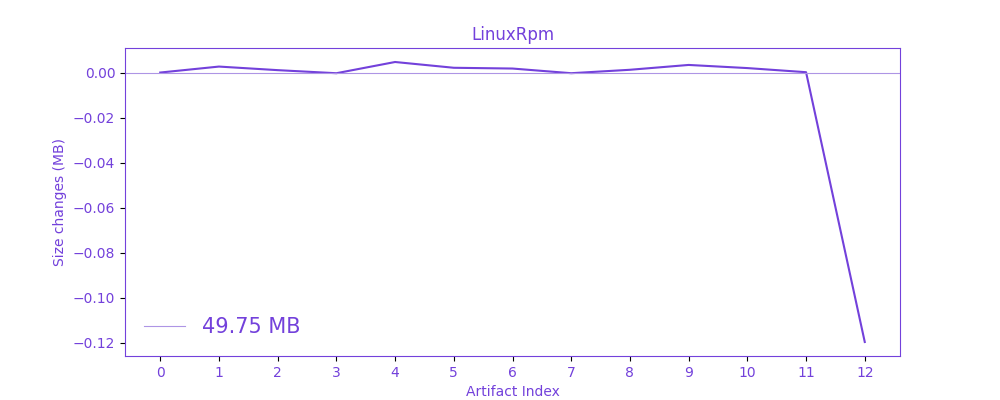

# artifacts-size-plot
Plots artifacts size change

For now this actions works only on linux
 
 
### You have to provide
* github-token
* repository-owner
* repository-name

### optional arguments:
* remove-prefix (removes this prefix from the artifacts title)
* remove-postfix (removes this postfix from the artifacts title)

### Preview

 
 
 This project was created because I wanted to add some reasonable plots to the readme, since an artifact is built on every commit, I have decided to plot their size change, but I wasn't able to find a working github actions for this, so I build it myself!